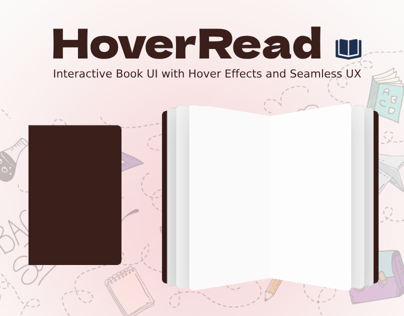

# ✨ HoverRead – Interactive Book UI with Hover Effects and Seamless UX 📚

**HoverRead** is a sleek, interactive UI project inspired by digital reading experiences. It features a clean book-style interface, smooth hover effects, and intuitive UX design, perfect for showcasing UI/UX skills or building a foundation for a digital publication platform.

## 🌐 Socials:
  

---

## 🚀 Features

- 📘 **Book-like Interface** – A visually pleasing layout mimicking real book pages.
- 🎯 **Smooth Hover Effects** – Interactive hover animations for buttons, links, and cards.
- 🧭 **User-Centered UX** – Designed with simplicity and navigation flow in mind.
- 💡 **Responsive Design** – Works across devices with a clean, mobile-friendly UI.
- ⚙️ **Modular Codebase** – Easy to extend and customize for your own content or ideas.

---

## 🛠️ Tech Stack

- **HTML5**
- **CSS3 / SCSS**
- **Figma (for UI/UX prototyping)**

---

 
Desktop Design 

 
Desktop Design  

 
Desktop Hover Effect Design 

 
Cover 

